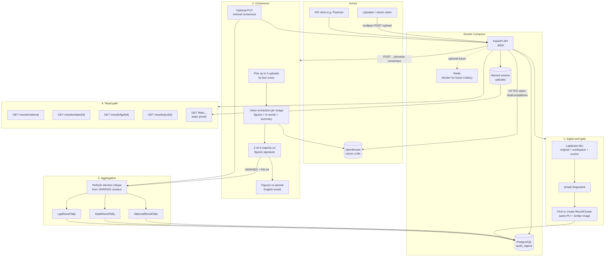
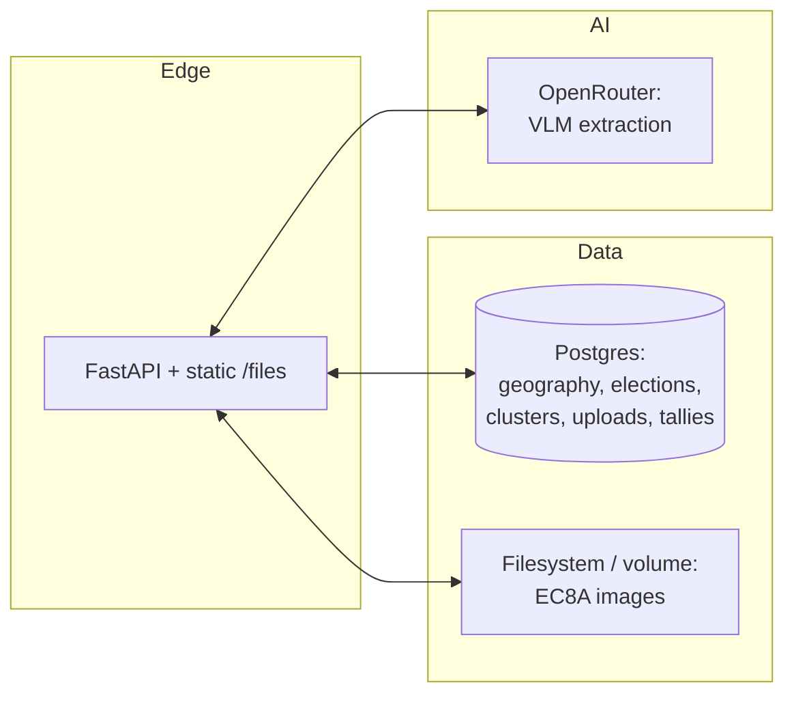

# AuditNigeria MVP — Architecture & checkpoint video outline

This document describes the **current backend architecture** (as implemented) and a **scene-by-scene breakdown** you can use when recording a checkpoint video.

---

## Architecture flow

### Layers view (optional second slide)

---

## Checkpoint video breakdown

Use each row as a **scene or talking point**. Times suit roughly a **6–12 minute** checkpoint video; stretch or compress as needed.

| # | Checkpoint title | What to show / say |
|---|------------------|-------------------|
| **1** | **Problem and goal** | Radical transparency: crowdsourced PU result sheets; compare to official narrative. INEC-style hierarchy: National → State → LGA → Ward → PU. |
| **2** | **Running the stack** | `docker compose up -d db api` (and Redis if you walk through `docker-compose.yml`). DB healthcheck, API on port 8000. `.env`: `OPENROUTER_API_KEY`, `PUBLIC_BASE_URL` (proof URLs). |
| **3** | **Data model (geography)** | Seed (`python -m app.db.seed`): Lagos + FCT states/LGAs; demo election + PU. Quick mental model: `State` → `LGA` → `PollingUnit` → `ResultCluster` + `Upload`. |
| **4** | **Upload path** | `POST /upload`: multipart file + `election_id` + `pu_id`. **Blur gate** (Laplacian; best score across original, workspace, zooms). **pHash** for dedupe. File path under `uploads/.../national/{state}/{lga}/{pu}/`. Response: `blur_score`, strategies, `phash`, `cluster_id`. |
| **5** | **Why clustering** | Same PU, perceptually similar photo → same `ResultCluster`; multiple proofs without double-counting until consensus runs. |
| **6** | **Consensus trigger** | `POST /results/clusters/{id}/process-consensus`. **Up to three** images (by blur) → each sent to **OpenRouter** vision. |
| **7** | **Ensemble rule** | **2-of-3** agreement on the **figures** JSON (party totals + summary). No majority → `DISPUTED`. |
| **8** | **Figures vs words** | Model returns **in figures** and **in words** per party (and optionally summary words). Server parses English number phrases and compares; mismatch → `DISPUTED` even if figures match across models. Note: empty `summary_in_words` skips that check; non-English words are not parsed. |
| **9** | **Human override** | `PUT /results/clusters/{id}/consensus` after verifying against the physical sheet; rollups refresh; payload can include `source: manual_correction`. |
| **10** | **Rollups** | On `VERIFIED`, aggregator recomputes JSONB tallies: **national**, **state**, **LGA** for that election from verified clusters. |
| **11** | **Drill-down API demo** | Live calls: `/results/national?election_id=1` → `/results/state/1` → `/results/lga/{ikeja_id}` → `/results/pu/1`. LGAs with no verified PUs show empty tallies. |
| **12** | **Proof / transparency** | PU response `proof_images` with `/files/...` URLs; tie numbers to uploaded EC8A images. |
| **13** | **Closing summary** | MVP path: upload → quality gate → cluster → VLM × N → majority + words cross-check → optional manual fix → rollups → public drill-down + file proofs. Optional next steps: auth on manual route, async consensus (Celery), S3, fuller geography seed. |

### B-roll ideas

- Postman collection: upload → process-consensus → national → state → LGA → PU.
- One rejected upload (blur) vs one accepted.
- Side-by-side `DISPUTED` vs `VERIFIED` if you have both examples.

---

## Related paths in the repo

| Area | Location |
|------|-----------|
| Upload + clustering | `backend/app/api/uploads.py`, `backend/app/services/image_service.py` |
| Vision + schema | `backend/app/services/ai_service.py` |
| Consensus + figures/words gate | `backend/app/services/consensus_engine.py`, `backend/app/services/number_words.py` |
| Rollups | `backend/app/services/aggregator.py` |
| Read APIs | `backend/app/api/results.py` |
| App entry + `create_all` | `backend/app/main.py` |
| Seed + schema bootstrap in seed | `backend/app/db/seed.py` |
| Docker | `docker-compose.yml`, `backend/Dockerfile` |
